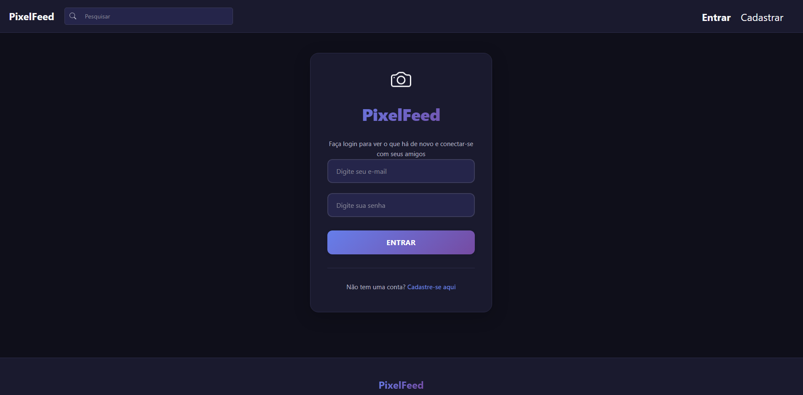

# 📸 PixelFeed - Rede Social

<div align="center">
  
  <br><br>

  <a href="https://pixel-feed-peach.vercel.app/login">
    
  </a>
</div>

<br>

## 📄 Sobre o Projeto
O **PixelFeed** é uma interface de rede social desenvolvida para exercitar a criação de componentes reutilizáveis e a renderização de listas dinâmicas no React.

O objetivo principal foi criar um layout fiel ao de grandes redes sociais, focando na interação do usuário (Likes, Comentários) e na estrutura de dados do Front-end.

---

## 🚀 Funcionalidades
* ✅ **Feed de Postagens:** Renderização dinâmica de posts com fotos e textos.
* ✅ **Interatividade:** Botões de "Curtir" e campo de comentários funcionais (Gerenciamento de Estado).
* ✅ **Componentização:** Reaproveitamento da estrutura de Post, Header e Sidebar.
* ✅ **Design Responsivo:** Adaptável para telas de desktop e mobile.

---

## 🛠️ Tecnologias Utilizadas

<div align="left">
  
  
  
</div>

---

## 📦 Como rodar o projeto

```bash
# Clone o repositório
$ git clone [https://github.com/JoaoAndreotti90/PixelFeed.git](https://github.com/JoaoAndreotti90/PixelFeed.git)

# Entre na pasta
$ cd PixelFeed

# Instale as dependências
$ npm install

# Rode o projeto
$ npm start
